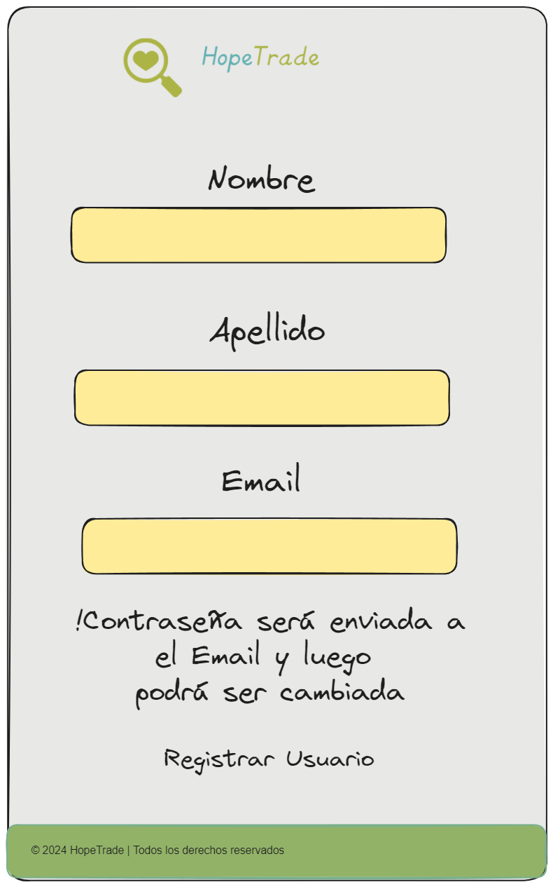

<h1> Char-IT | Grupo </h1>

---

### Calendario

- [x] 11/03/2024 Entrevista 1
- [x] 18/03/2024 Entrevista 2
- [x] 25/03/2024 Entrega + Cuestionario + Epicas
- [ ] 08/04/2024 Consulta entrega 2
- [ ] 15/04/2024 Consulta entrega 2
- [ ] 22/04/2024 Documentación + Pila de producto
- [ ] 29/04/2024 Revisión pila + Planificación
- [ ] 06/05/2024 Scrum diario 1
- [ ] 13/05/2024 Scrum diario 1
- [ ] 20/05/2024 Demo 1 + Planning 2
- [ ] 27/05/2024 Scrum diario 2
- [ ] 03/06/2024 Scrum diario 2
- [ ] 10/06/2024 Demo 2 + Planning 3
- [ ] 24/06/2024 Scrum diario 3
- [ ] 01/07/2024 Scrum diario 3
- [ ] 08/07/2024 Demo 3

---

### Sistema Online

- [Pagina Inicial](#pagina-inicial)
  - [Iniciar Sesión](#iniciar-sesión)
  - [Registrar Usuario](#registrar-usuario)
- [Pagina Principal](#pagina-inicial)
  - [Menu](#menu)
  - [Subir Producto](#subir-producto)
  - [Mis Productos](#mis-productos)
  - [Realizar Donación](#realizar-donación)
  - [Mis Donaciones](#mis-donaciones)
  - [Seleccionar Producto](#seleccionar-producto)
  - [Cerrar Perfil]()
- [Editar Producto]()

---

## Pagina Inicial

<table><td>

</td>
<td>

- Información de Cáritas
- Ubicación de las filiales con la dirección
- Horario de atención
</td></table>

---

## Iniciar Sesión

<table><tr><td>

Iniciar Sesión

</td><td>

Registrar Usuario

</td></tr>

<tr><td>

</td><td>

</td></tr>
</table>

---

# Usuario General

<table>
<tr><td>Pagina Principal</td><td>Menu</td></tr>
<tr><td>

</td><td>

</td></tr>
<tr><td>Subir Producto</td><td>Mis Productos</td></tr>
<tr><td>

</td><td>

</td></tr>
<tr><td>Realizar Donación</td><td>Notificaciones</td></tr>
<tr><td>

</td><td>

</td></tr>
<tr><td>Seleccionar Producto</td><td>Cerrar Perfil</td></tr>
<tr><td>

</td><td>

</td></tr>
</table>

---

## Mis Donaciones

Todavia no esta, pero se supone que es un listado de las donaciones para mi usuario

---

# Owner ✒️

## Registrar Colaborador

